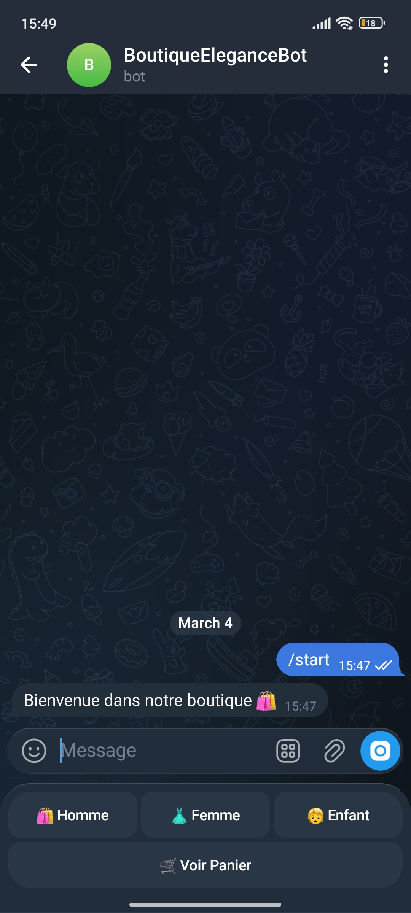
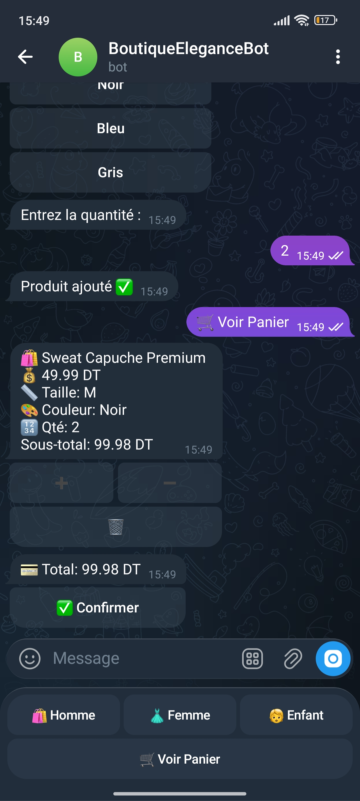
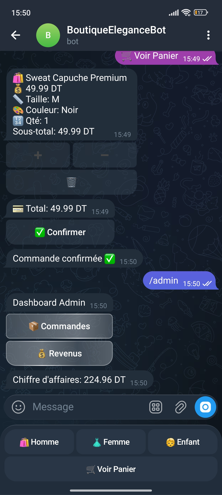

# 🛒 Telegram Ecommerce Bot

A fully functional Telegram Ecommerce Bot built with Python and MongoDB.  
This bot allows users to browse products, add items to cart, and place orders directly via Telegram.

---

## 🤖 Live Demo

👉 https://t.me/BoutiqueEleganceBot

---

## 🚀 Features

- 🛍 Browse Products
- 🛒 Add to Cart
- 📦 Place Orders
- 👨‍💼 Admin Product Management
- 💾 MongoDB Database Integration
- 🔐 Secure Environment Variables (.env)

---

## 🛠 Tech Stack

- Python 3
- python-telegram-bot
- MongoDB
- PyMongo
- python-dotenv

---

## 📸 Screenshots

### Main Menu


### Product List


### Cart


### Admin Panel


---

## ⚙️ Installation

Clone the repository:

```bash
git clone https://github.com/YOUR_USERNAME/telegram-ecommerce-bot.git
cd telegram-ecommerce-bot
